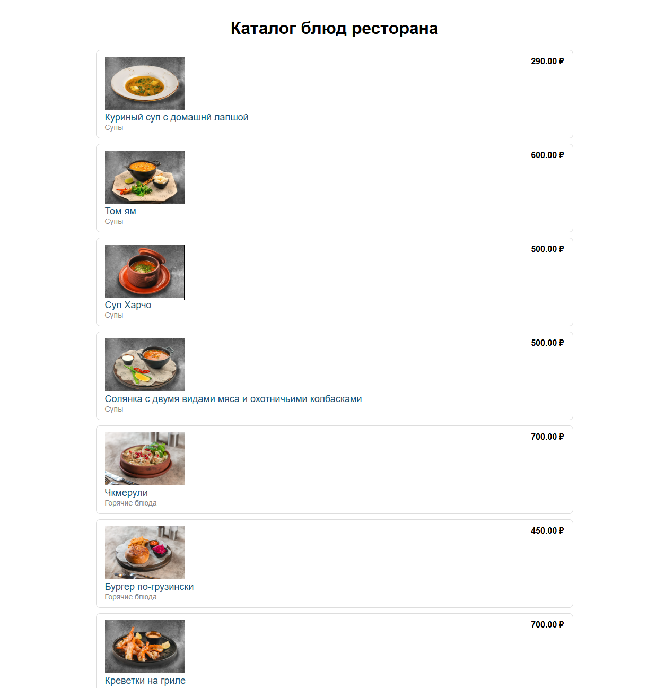
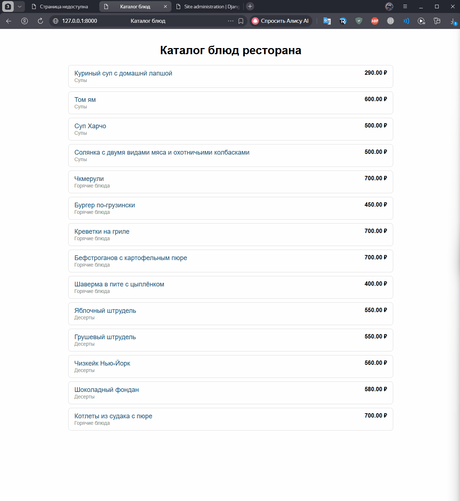

# Онлайн каталог продукции ресторана

[](https://qlty.sh/gh/bogotto/projects/restaurant-catalog)

Веб-приложение — онлайн-каталог блюд ресторана. Посетитель просматривает меню по категориям и открывает карточку блюда с описанием, ценой и весом. Администратор управляет категориями и блюдами через панель управления.

## Стек

- **Backend:** Python 3.14, Django 6
- **Frontend:** HTML, CSS (Django Templates)
- **База данных:** SQLite (локально)
- Pillow — работа с изображениями

## Возможности

- Каталог блюд с разбивкой по категориям
- Карточка блюда с описанием, ценой и весом
- Фотографии блюд (загрузка через админку)
- Панель администратора для управления каталогом

## Скриншот каталога



## Как запустить локально

```bash
git clone https://github.com/bogotto/restaurant-catalog.git
cd restaurant-catalog
py -m venv venv
venv\Scripts\activate
pip install django
py manage.py migrate
py manage.py runserver
```

После запуска открыть в браузере: http://127.0.0.1:8000/
Админка: http://127.0.0.1:8000/admin/

## Демонстрация работы



## Демонстрация(деплой)

🔗 Live: https://bogotto.pythonanywhere.com/
Тестовый вход в админку: admin1 / 12345678

## Автор

Геллер Владлен, группа 01-23.ИСИП.ОФ.11

